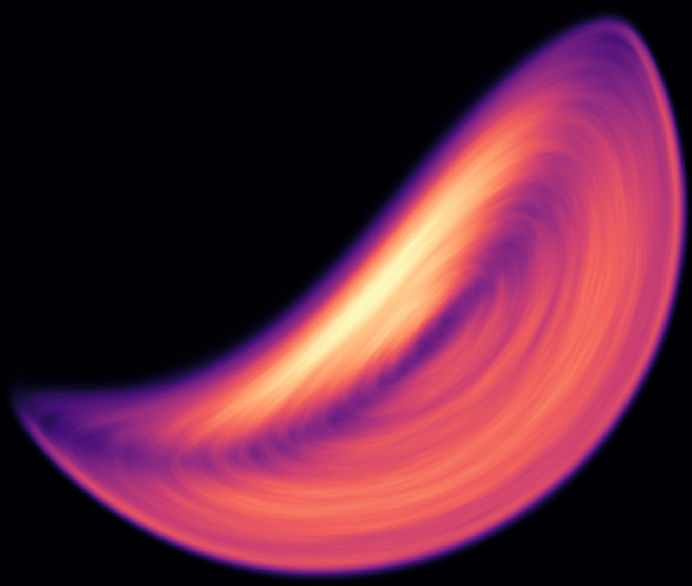
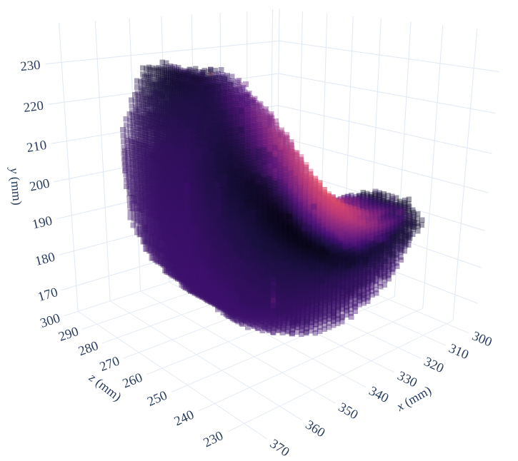

..
   File   : index.rst
   License: GNU v3.0
   Author : Andrei Leonard Nicusan <a.l.nicusan@bham.ac.uk>
   Date   : 28.06.2020

=====================================
The KonigCell Library's Documentation
=====================================

Quantitative, Fast Grid-Based Fields Calculations in 2D and 3D - Residence Time
Distributions, Velocity Grids, Eulerian Cell Projections etc.

That sounds dry as heck.

**Project moving particles' trajectories (experimental or simulated) onto 2D or 3D
grids with infinite resolution.** Better? No? Here's a pretty explanatory graph:

*Heatmap of a 2D residence time distribution in a GranuTools GranuDrum, imaged
using Positron Emission Particle Tracking.*

This is, to my knowledge, the only library that accurately projects particle
trajectories onto grids - that is, taking their full projected area / volume into
account (and not approximating them as points / lines).

It's also the only one creating quantitative 3D projections:

*Scatter plot of a 3D velocity distribution in a GranuTools GranuDrum, imaged
using Positron Emission Particle Tracking.*

And it is *fast* - 1,000,000 particle positions can be rasterized onto a 512x512
grid in 7 seconds on my 16-thread i9 CPU. The code is fully parallelised on
threads, processes or distributed MPI nodes.

Tutorials and Documentation
===========================
At the top of this page, see the "Getting Started" tab for installation help; the
"Tutorials" section has some explained high-level examples of the library. Finally,
all exported functions are documented in the "Manual".

Contributing
============
You are more than welcome to contribute to this library in the form of library
improvements, documentation or helpful examples; please submit them either as:

- GitHub issues.
- Pull requests (superheroes only).
- Email me at <a.l.nicusan@bham.ac.uk>.

Acknowledgements
================
I would like to thank the Formulation Engineering CDT @School of Chemical
Engineering and the Positron Imaging Centre @School of Physics and
Astronomy, University of Birmingham for supporting my work.

And thanks to Dr. Kit Windows-Yule for putting up with my bonkers ideas.

Citing
======
If you use this library in your research, you are kindly asked to cite:

    <Paper after publication>

This library would not have been possible without the excellent `r3d` library
(https://github.com/devonmpowell/r3d) which forms the very core of the C
subroutines; if you use KonigCell in your work, please also cite:

    Powell D, Abel T. An exact general remeshing scheme applied to physically conservative voxelization. Journal of Computational Physics. 2015 Sep 15;297:340-56.

Licensing
=========
KonigCell is MIT licensed. Enjoy.

Indices and tables
==================

.. toctree::
   :caption: Documentation
   :maxdepth: 2

   getting_started
   tutorials/index
   manual/index

Pages

* :ref:`genindex`
* :ref:`modindex`
* :ref:`search`
