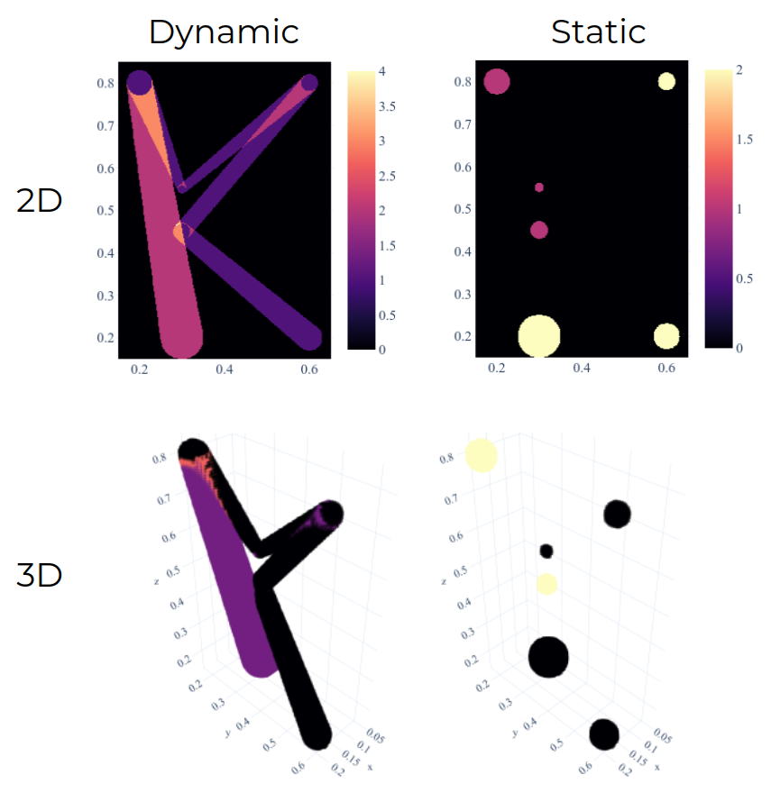
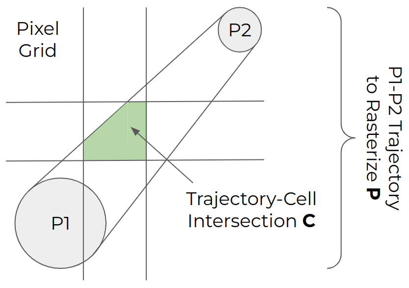
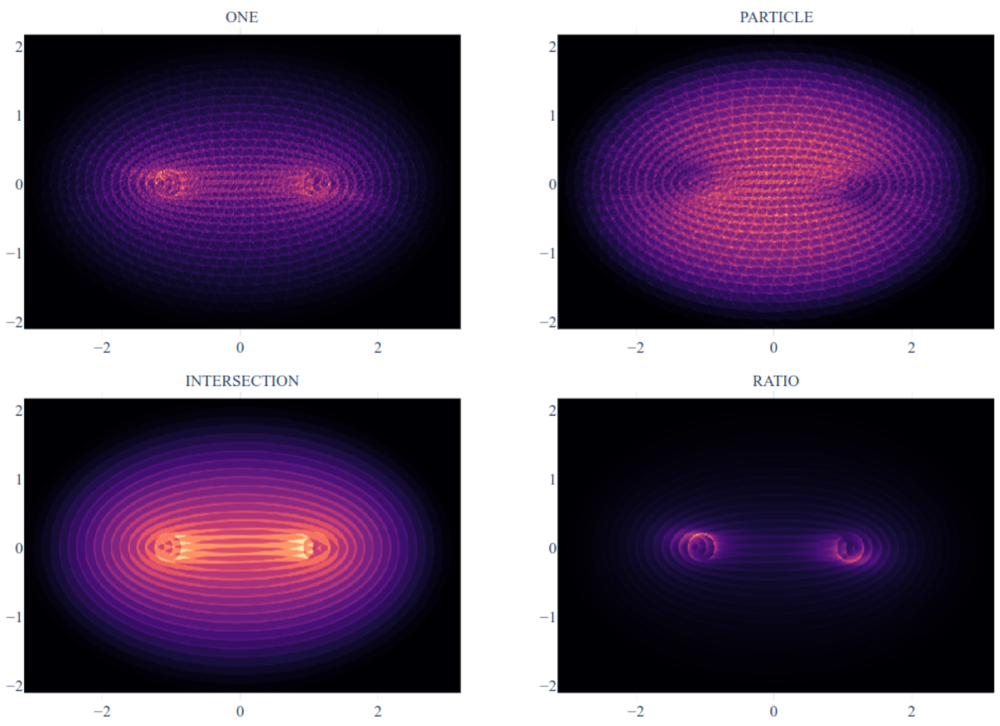

*******************
KonigCell Tutorials
*******************

Rasterizations using KonigCell can be done in a couple of ways:

- Dynamic trajectories / static particles.
- 2D pixels / 3D voxels.
- Splitting a raster's values across cells (``konigcell.mode``) - this is more subtle, see below.

The code for generating these frames is given in the ``Basic Tutorials`` section.

Rasterization Modes
===================

Given a particle moving between positions [P1, P2, P3, ...], we will rasterize given values
[V1, V2, V3, ...] onto a 2D / 3D grid. The values can be any particle property - velocity,
time taken to move between two locations, etc.

For a dynamic particle moving between positions P1 and P2, we will rasterize value **V1** onto the
grid of cells. But what value should each cell contain?

Let the area shaded by the particle moving between P1 and P2 be **P**; the area intersected by
**P** and a given grid cell is **C**. The rasterization ``mode`` determines what value the
intersected grid cell should have:

- ``kc.ONE`` - add the value **V1**; e.g. velocity.
- ``kc.PARTICLE`` - add the value **V1 * P**.
- ``kc.INTERSECTION`` - add the value **V1 * C**.
- ``kc.RATIO`` - add the value **V1 * C / P**; e.g. time spent should be split across each intersection.

Here is an accelerating particle moving in an inward spiral, rasterizing its velocity using different modes:

.. toctree::
   :caption: Basic Tutorials
   :maxdepth: 2

   dynamic2d
   dynamic3d
   static2d
   static3d
   modes

