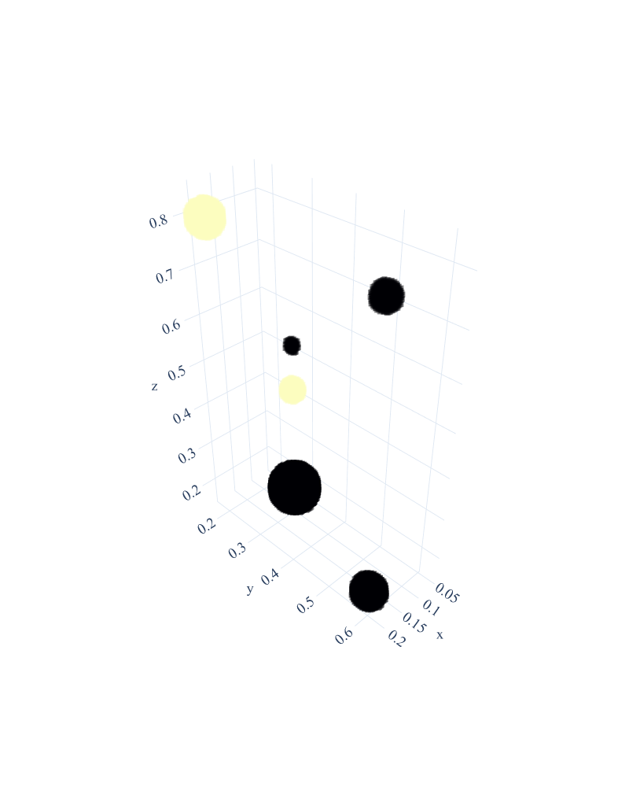

Static Particle Pixellisation (3D)
==================================

::

    import numpy as np
    import konigcell as kc

    # Generate a short trajectory to pixellise
    positions = np.array([
        [0.1, 0.3, 0.2],
        [0.2, 0.2, 0.8],
        [0.1, 0.3, 0.55],
        [0.2, 0.6, 0.8],
        [0.1, 0.3, 0.45],
        [0.2, 0.6, 0.2],
    ])

    radii = np.array([0.05, 0.03, 0.01, 0.02, 0.02, 0.03])
    values = np.array([1, 2, 1, 1, 2, 1])

    # Pixellise the moving particle
    voxels = kc.static3d(
        positions,
        kc.ONE,
        radii = radii,
        values = values,
        resolution = (100, 100, 100),
    )

    # Show a Plotly heatmap of the pixels
    fig = kc.create_fig()
    fig.add_trace(voxels.scatter_trace())
    fig.show()

