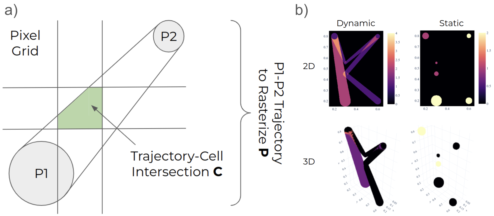
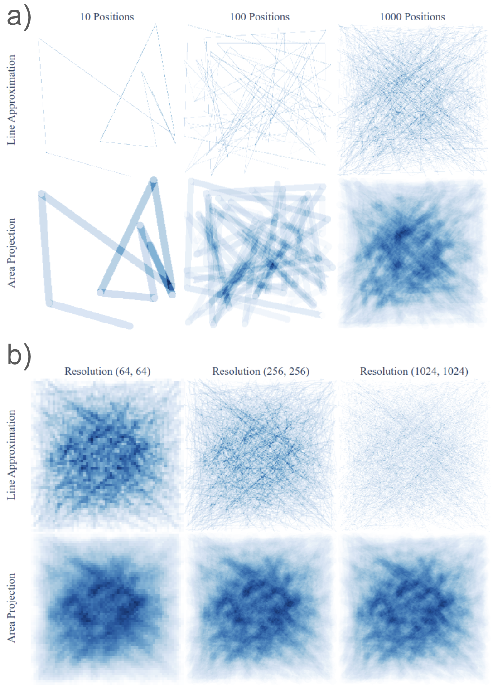
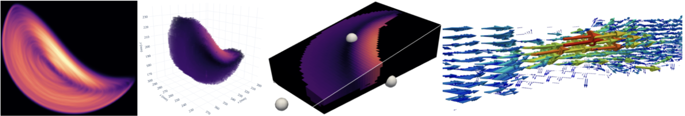

# Summary

Many experimental and simulation workflows generate **trajectories**—time-ordered positions of moving particles, probes, or features—with a **finite spatial extent** (e.g., sensor diameter, tracer radius). Standard polyline rendering treats each step as an infinitesimally thin segment, which breaks connectivity, aliases strongly, and yields densities that vary with sampling and grid resolution. **KonigCell** is a lightweight Python/C library that instead **rasterises the swept area/volume** of each finite-radius step into 2D pixels or 3D voxels. The result is a stable, resolution-agnostic aggregation that supports residence-time maps, occupancy fields, and trajectory-derived statistics.

KonigCell provides high-level functions for **dynamic** (line-sweep) and **static** (disc/sphere) rasterisation in 2D and 3D; multiple **weighting modes** (e.g., unit weight, particle weight, intersection/coverage, and ratio/normalisation); and helpers that turn occupancy into **probability/normalised densities**. Implementations are available in pure Python and in a compiled C backend for performance.

Figure 1 illustrates the rasterisation concept and representative outputs. Figure 2 compares polyline vs. area/volume projection across sampling density and grid resolution, highlighting KonigCell’s stability. Figure 3 shows example applications: 2D residence time, 3D voxelised occupancy with slicing, and velocity-field aggregation.

{width=100%}

# Statement of need

Researchers in particle tracking (e.g., **positron emission particle tracking**, PEPT), granular and multiphase flows, and Lagrangian CFD often need to convert trajectories into fields for analysis, inference, or visualisation [@windows2022recent]. Treating steps as thin polylines causes (i) **aliasing** and visually misleading filamentation, (ii) **grid-dependent** densities, and (iii) **loss of connectivity** when sampling is sparse. These artefacts complicate quantitative comparisons and can bias downstream inferences. KonigCell addresses this by **explicitly accounting for finite sensor/particle size**: each trajectory segment contributes the **exact cell-wise intersection area/volume** with a given pixel/voxel grid, ensuring that the aggregate reflects *coverage* rather than line drawing.

By providing a small, well-documented API with a fast C core, KonigCell lowers the barrier to robust trajectory aggregation in Python while remaining easy to integrate in analysis notebooks and pipelines. Target users are experimentalists and modellers who need reliable **residence-time/occupancy maps**, **voxelised fields**, or **trajectory-derived statistics** in 2D or 3D, without resorting to bespoke geometry code.

{width=100%}

# State of the field

General-purpose voxelisation and rasterisation libraries typically focus on meshes or infinitesimal curves. Exact polygon/voxel intersection for **swept volumes** has seen adoption in ray tracing and voxel graphics, but tools aimed at **scientific trajectory aggregation** are sparse. KonigCell complements packages for Lagrangian analysis and PEPT by (i) exposing a **minimal, purpose-built API** for dynamic/static swept geometry, (ii) offering **weighting modes** suited to scientific density and probability estimation, and (iii) shipping both Python and C implementations to balance readability and speed.

Related approaches include exact rasterisation/voxelisation techniques such as **r3d** [@powell2015r3d] and line-based approximations as used in **up4** [@uobpic_up4_2025]. **KonigCell builds on r3d’s robust clipping and moment computation**, adapting it for trajectory swept-volume rasterisation: we specialise to **zeroth-order moments** (area/volume), inline the required r3d declarations/definitions, remove variable-length arrays for portability, and add precision-specific intrinsics. On top of this kernel we implement the swept geometry (discs/spheres and spherical cylinders), grid traversal, scientific weighting modes, and thread-level parallelisation. Thus KonigCell is **geometrically exact at the grid level** while remaining simple and fast for routine use.

# Functionality overview

- **Dynamic sweep (2D/3D):** rasterise the area/volume swept between successive positions with a specified radius.
- **Static aggregation (2D/3D):** accumulate discs/spheres at given positions (useful for time-collapsed occupancy).
- **Weighting modes:** `ONE`, `PARTICLE`, `INTERSECTION` (coverage), `RATIO` (normalised by local path length/area), enabling residence-time and probability maps.
- **Probability helpers:** convenience functions to transform raw accumulators into normalised probability densities.
- **Backends:** a parallelised Python interface and a C implementation of the 2D and 3D kernels for performance.

{width=100%}

# Quality control

We provide example scripts and tutorials that reproduce the figures and validate the **mode semantics** on synthetic cases with analytically known intersections. Automated tests (via `pytest`) cover:
1. cell-wise intersection weights for simple geometries,
2. equivalence between 2D/3D API variants on degenerate inputs,
3. probability normalisation invariants,
4. robustness to separators/NaNs between trajectories, and
5. determinism across workers for fixed seeds.

Performance is demonstrated on million-step workloads common in PEPT/CFD post-processing; a small benchmark is included for reproducibility. Reviewers can run the full test suite via `pytest` and rebuild the figures from the `paper` scripts.

# Availability

The software is released under the MIT License and archived with an immutable DOI (Zenodo) corresponding to the exact version submitted to JOSS [@konigcell-zenodo]. Source code, documentation, and usage examples are hosted on GitHub.

# Acknowledgements

We thank colleagues and students in the School of Chemical Engineering (University of Birmingham) for feedback on early prototypes and example datasets, and acknowledge internal support that enabled the development and testing of KonigCell.

# References
